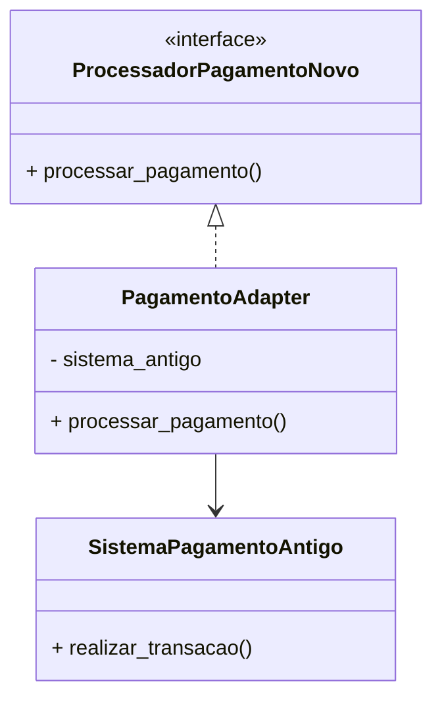

# ✅ **README — Adapter**  
(Copie apenas este para a pasta `/adapter`)

```markdown
# Padrão de Projeto Estrutural: Adapter

O código presente nesta pasta se baseia no conteúdo do site "Refactoring Guru", referenciado no link abaixo:  
https://refactoring.guru/pt-br/design-patterns/adapter

## Linguagem de programação usada

Para realizar a implementação deste padrão foi utilizada a linguagem **Python** no VSCode.  
Para executar o projeto, é necessário:

- Python 3.10+
- Extensão Python no VSCode

## Utilização da LLM

Foi utilizada a LLM **ChatGPT** para auxílio na estruturação do código, revisão e explicações conceituais.

## O que é o padrão Adapter e o que ele resolve?

O Adapter é um padrão de projeto **estrutural** que permite que duas interfaces incompatíveis funcionem juntas.  
Ele age como um **tradutor** entre sistemas diferentes.

Ele resolve problemas como:

- integração entre código novo e código legado;
- incompatibilidade entre interfaces;
- necessidade de reutilizar componentes antigos sem modificá-los.

## Exemplo de implementação

O sistema moderno espera um método: processar_pagamento(valor)

Mas um sistema legado só aceita chamadas: realizar_transacao(valor)

O Adapter é usado para traduzir a nova chamada para o formato antigo, permitindo compatibilidade total.

---

## Explicação do código

### **processador_novo.py**
- Interface moderna que o sistema espera.

### **sistema_antigo.py**
- Sistema legado com método incompatível.

### **pagamento_adapter.py**
- Classe Adapter que converte chamadas da nova interface para a interface antiga.

### **main.py**
- Demonstra a integração entre o sistema moderno e o antigo através do adapter.

