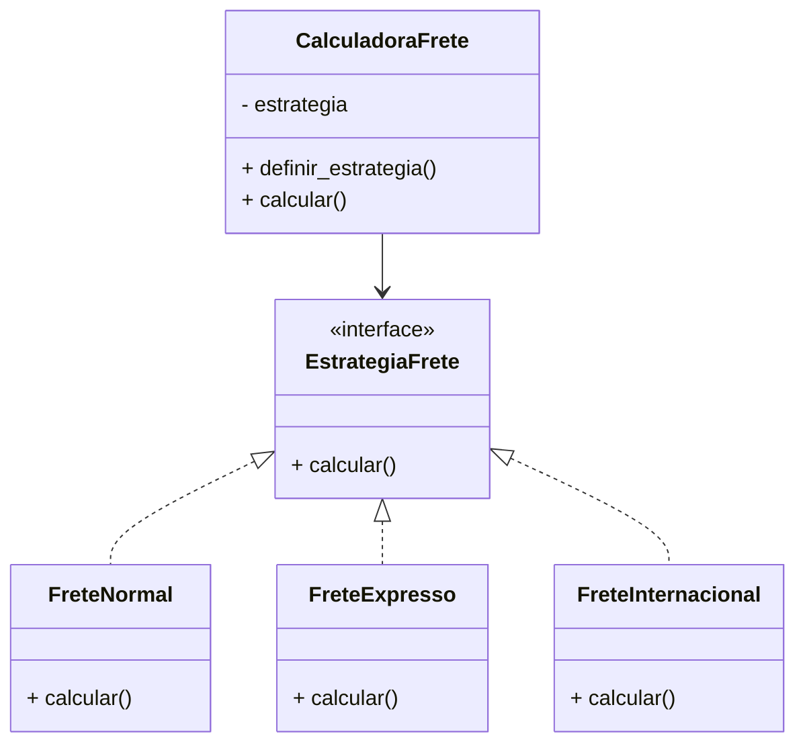

# Padrão de Projeto Comportamental: Strategy

O código presente nesta pasta se baseia no conteúdo do site "Refactoring Guru", referenciado no link abaixo:  
https://refactoring.guru/pt-br/design-patterns/strategy

## Linguagem de programação usada

A implementação deste padrão foi realizada usando a linguagem **Python** no VSCode.

---

## Utilização da LLM

Foi utilizada a LLM **ChatGPT** para auxiliar na elaboração do código, explicações conceituais e revisão.

---

## O que é o padrão Strategy e o que ele resolve?

O Strategy é um padrão de projeto **comportamental** que permite definir vários algoritmos diferentes e trocar entre eles dinamicamente.

Ele resolve problemas como:

- muitos blocos `if/else` para determinar o comportamento;
- dificuldade de adicionar novas variações sem modificar código existente;
- falta de flexibilidade.

---

## Exemplo de implementação

Um sistema de cálculo de frete possui três estratégias:

- Frete Normal  
- Frete Expresso  
- Frete Internacional  

Cada uma possui seu próprio algoritmo, e o usuário pode trocar entre elas em tempo real.

---

## Explicação do código

### **estrategia_frete.py**
Interface base para todas as estratégias.

### **frete_normal.py, frete_expresso.py, frete_internacional.py**
Implementações concretas das estratégias de cálculo.

### **calculadora_frete.py**
Classe que utiliza a estratégia definida.

### **main.py**
Demonstração prática de troca dinâmica de estratégias.

